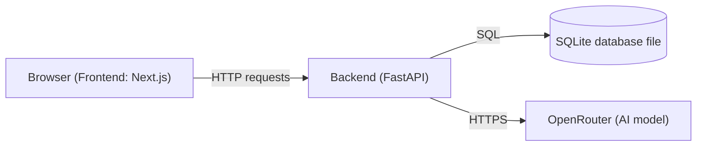

# How This Project Was Built — A Beginner's Guide

This document explains, category by category, what was built for the Project
Management MVP, why each choice was made, how the pieces fit together, and
what commonly goes wrong with each part. It assumes no prior full-stack
experience.

---

## 1. The Big Picture

A web app almost always has two halves:

- **Frontend**: the part that runs in the user's browser. It draws the
  screen, reacts to clicks, and talks to the backend over the network.
- **Backend**: a program that runs on a server (or, here, inside a Docker
  container on your own machine). It stores data, enforces rules (like "you
  must be logged in"), and talks to external services (like the AI provider).

They communicate using **HTTP requests** — the same protocol your browser
uses to load any web page. The frontend sends a request like
`GET /api/board`, and the backend sends back a response, usually as **JSON**
(a text format for structured data, e.g. `{"title": "Backlog"}`).

Everything in this project runs inside **one Docker container**, so you don't
need to install Python, Node.js, or a database server on your own machine —
Docker packages all of that up for you.

---

## 2. Categories of What Was Built

### 2.1 Frontend (Next.js + React + TypeScript)

**What it is**: The Kanban board UI — columns, cards, drag-and-drop, the
login screen, and the AI chat sidebar. Built with:

- **React**: a library for building UI out of reusable "components" (small
  functions that return HTML-like markup called JSX).
- **Next.js**: a framework built on top of React that adds routing, a build
  system, and the ability to export a static site (plain HTML/CSS/JS files).
- **TypeScript**: JavaScript with type-checking added, so mistakes like
  passing a number where a string is expected are caught before the code
  even runs.
- **Tailwind CSS**: a way of styling elements using utility class names
  (e.g. `text-sm`, `bg-white`) instead of writing separate CSS files.
- **dnd-kit**: a library specifically for drag-and-drop interactions.

**Why these choices**: This is close to the "default modern stack" for a
small React app in 2026 — well documented, huge community, and Next.js's
static export feature meant the backend could serve the whole frontend as
plain files without needing a separate Node.js server running in production.

**What commonly goes wrong**:
- **Stale state bugs**: React re-renders components when data changes. If
  you capture a value too early (before an `await`) it can go stale. We hit
  exactly this: the chat form's `event.currentTarget` became `null` after an
  `await`, silently breaking the "refresh the board" button. Fix: capture
  the reference *before* the asynchronous call.
- **CSS layout breakpoints**: this app switches from a single stacked column
  to a 5-column grid at a certain screen width (`lg:` breakpoint in
  Tailwind). Below that width, all columns stack vertically. This caused a
  confusing test failure — see section 5.
- **Client/server split confusion**: Next.js can render some code on the
  server and some in the browser. Anything using browser-only APIs (like
  `window`) needs the `"use client"` marker at the top of the file.

### 2.2 Backend (FastAPI + Python)

**What it is**: A small Python web server exposing endpoints like
`/api/login`, `/api/board`, `/api/cards/{id}/move`, and `/api/chat`. Built
with:

- **FastAPI**: a Python framework for building HTTP APIs. It automatically
  validates incoming JSON against declared types (via **Pydantic** models),
  and generates interactive API docs for free.
- **uv**: a fast, modern Python package/dependency manager (an alternative
  to `pip` + `venv`). It reads `pyproject.toml` to know what to install.
- **Uvicorn**: the actual program that runs the FastAPI app and listens for
  HTTP connections.

**Why these choices**: FastAPI is fast to write, has excellent built-in
input validation (important for security — see section 4), and is one of
the most popular Python web frameworks today. `uv` is significantly faster
than older tools and produces a lockfile (`uv.lock`) so builds are
reproducible.

**What commonly goes wrong**:
- **Forgetting to validate input**: if you trust whatever the frontend
  sends, a malicious user could send anything. FastAPI + Pydantic models
  (e.g. `class LoginRequest(BaseModel)`) reject malformed requests
  automatically.
- **Blocking the server**: a slow database call or network request can
  freeze the whole server if not handled correctly. Not a major issue at
  this small scale, but worth knowing for growth.
- **Import/packaging path issues**: we hit an early bug where `pytest`
  couldn't find the `app` package inside a container because the working
  directory wasn't on Python's import path — fixed by adding
  `pythonpath = ["."]` to `pyproject.toml`.

### 2.3 Database (SQLite)

**What it is**: A single-file, serverless database — the entire database is
one file (`pm.db`) rather than a separate program you have to run. Good fit
for a small, single-user MVP.

**Why this choice**: Zero setup, no separate database server to configure,
and it's included in Python's standard library. It's not meant for
high-concurrency production apps with many simultaneous writers, but it's an
excellent, boring, reliable choice for an MVP.

**Design decisions**:
- Tables: `users`, `boards` (one per user), `columns` (fixed at 5, ordered by
  a `position` number), `cards` (each belongs to one column, also ordered by
  `position`), and `messages` (persisted AI chat history).
- The database and its seed data (the demo columns/cards) are created
  automatically the first time the app starts, so there's no manual setup
  step.

**What commonly goes wrong**:
- **Losing data on restart**: if the database file lives *inside* the
  container's normal filesystem, it's deleted every time the container is
  rebuilt. Fixed by using a **Docker named volume** (`pm_pm_data`) mounted at
  `/data` — this is storage that lives outside the container's lifecycle.
- **Half-finished writes ("race conditions")**: if you update two rows (e.g.
  "remove card from old position" and "insert card at new position") as two
  separate, unprotected steps, a crash in between could corrup the data.
  Fixed by wrapping each mutation in a single database transaction (SQLite's
  `with connection() as database:` block commits everything together or
  nothing at all).
- **Forgetting to re-index**: when moving a card out of a column, everything
  below it needs to shift up by one position, or you'll get gaps or
  duplicate position numbers. This was the root cause of an actual bug — see
  section 5.

### 2.4 Authentication (Login/Session)

**What it is**: A login form that accepts only the hardcoded `user` /
`password` credentials for this MVP, and a **signed, HTTP-only cookie** that
proves "this browser is logged in" on every subsequent request.

**Key security concepts**:
- **HTTP-only cookie**: JavaScript in the browser cannot read this cookie
  (protects against a class of attack called XSS, where malicious injected
  script tries to steal your session).
- **Signed**: the cookie's value is combined with a secret key using HMAC
  (a cryptographic signature) so the backend can detect if a user tried to
  tamper with it (e.g. changing `user` to `admin`).
- Passwords/credentials are never stored in the frontend code — the check
  happens entirely on the backend.

**What commonly goes wrong**:
- Storing session tokens in `localStorage` instead of an HTTP-only cookie —
  this is readable by any JavaScript on the page, making it vulnerable to
  XSS attacks. We avoided this by using cookies.
- Forgetting to protect *every* sensitive endpoint. We used a FastAPI
  "dependency" (`require_session`) attached to each board/chat route so it's
  applied consistently rather than repeated and possibly forgotten.
- Using a default/guessable secret key in production. For a real product
  you'd want a strong, unique `SESSION_SECRET` environment variable. The app
  requires one and refuses to start without it, rather than falling back to
  a secret written in the source code.

### 2.5 Containerization (Docker)

**What it is**: A `Dockerfile` describes how to build a self-contained image
that includes Python, the backend code, and the pre-built frontend files.
`compose.yaml` describes how to run that image, including the port mapping
and the persistent data volume.

**Why this choice**: "It works on my machine" is a classic problem — Docker
guarantees the exact same environment runs on any machine that has Docker
installed, regardless of what's installed on the host OS.

**How the build works (multi-stage build)**:
1. **Stage 1 ("frontend-build")**: uses a Node.js image to run
   `npm run build`, which produces static HTML/CSS/JS files.
2. **Stage 2**: uses a Python (`uv`) image, copies in the backend code *and*
   the static files produced by stage 1, then only this final, smaller image
   is kept. Node.js itself isn't part of the final image — it was only
   needed to *produce* files.

**What commonly goes wrong**:
- **Rebuilding dependencies at every container start**: we originally ran
  `uv run` at container start-up, which tried to re-resolve dependencies
  every time, adding needless delay and occasionally different results.
  Fixed by installing dependencies once at *build* time and running with
  `--no-sync` at start time.
- **Networking quirks inside containers**: an optional performance library
  (`uvloop`) didn't work correctly in this specific Docker networking setup
  and silently prevented the server from ever binding to its port. Diagnosed
  by testing with the plain/portable event loop (`--loop asyncio`) instead.
- **Forgetting to persist data**: without a named volume, `docker compose
  down` (or a rebuild) wipes the database. We mounted `pm_pm_data:/data`
  specifically to avoid this.

### 2.6 Testing

Two different kinds of automated tests were written, for two different
purposes:

- **Unit tests** (Vitest for the frontend, pytest for the backend): test one
  small function or component in isolation, often with fake/mocked data. Fast
  to run (milliseconds), so you run them constantly while coding.
- **Integration/end-to-end (E2E) tests** (Playwright): drive a real, actual
  browser against the real, running application (in this case, the actual
  Docker container) and simulate what a real user does — clicking, typing,
  dragging. Slower, but catches problems unit tests can't see, like "does
  the button actually work when clicked in a real browser".

**Why both**: unit tests give fast, precise feedback on logic bugs.
Integration tests catch the things that only show up when all the pieces
are wired together for real — like the actual drag-and-drop bug described
below, which no unit test could have caught because it only manifests with
real pointer events and real CSS layout.

**What commonly goes wrong**:
- **Flaky tests due to shared state**: since this project persists data in a
  single database, running the same E2E test repeatedly kept *adding* more
  cards without ever cleaning up, making the board grow larger and larger
  and eventually breaking unrelated assumptions (see section 5). Production
  test suites usually reset to a known, clean state before each test run.
- **Testing implementation details instead of behavior**: an early test
  checked for one specific hard-coded fixture ID (`card-card-1`). Once the
  seed data changed slightly, the test broke for reasons unrelated to a real
  bug. Better tests interact the same way a real user would (find a card by
  its visible text) rather than depending on internal IDs.

### 2.7 AI Integration (OpenRouter)

**What it is**: The backend sends the current board (as JSON), the chat
history, and the user's new message to an AI model via **OpenRouter** (a
service that provides access to many AI models through one API). The model
is asked to reply with **structured output** — not free text, but a strict
JSON shape: `{"response": "...", "operations": [...]}`. Each "operation" is
a validated instruction like "create a card" or "move a card."

**Why structured output + validation matters**: an AI model can produce
unpredictable text. If we let it directly run arbitrary commands, a
malformed or malicious response could corrupt the board. Instead, the
backend:
1. Requires the model to output an exact JSON shape.
2. Validates every field before doing anything with it.
3. Only applies operations through the *same* board-mutation functions used
   by the regular API — so the AI has no special, riskier code path.

**What commonly goes wrong**:
- **Trusting the AI blindly**: without validation, a bad or manipulated
  response could delete every card, or the JSON could simply be malformed
  and crash the server. We return an error to the user instead of half
  applying a broken instruction.
- **Leaking the API key**: the OpenRouter key lives only in the backend's
  environment (`.env`), never sent to the browser. If it were embedded in
  frontend JavaScript, anyone could open developer tools and steal it.
- **Automated tests calling the real AI**: this costs money and is
  unpredictable (the model might phrase things differently each time).
  Instead, automated tests replace ("mock") the AI call with a fixed fake
  response, and only a manual, opt-in check calls the real service.

---

## 3. The Optimal Way to Approach a Project Like This

If you were starting this from scratch yourself, a sensible order is:

1. **Write down requirements and constraints first** (this project used a
   `docs/PLAN.md` with a numbered checklist per phase, approved before
   coding began).
2. **Build the smallest possible "hello world" end-to-end slice first** —
   here, that was a static page calling one API endpoint inside Docker,
   before any real feature existed. This proves the *plumbing* works before
   you build features on top of it.
3. **Layer features one at a time**, each with its own tests, rather than
   building the whole thing and testing at the end. Every phase in this
   project ended with a test run before moving to the next.
5. **Automate validation as you go** — running the same manual checklist
   every time you change code doesn't scale, and humans get tired and skip
   steps; a computer running the same test never does.
6. **Treat "done" as "proven", not "written"** — several bugs in this
   project (the drag-and-drop issue, the chat refresh bug) were only caught
   because the AI insisted on running the real, full application rather than
   assuming the code was correct after writing it.

---

## 4. Security Principles Applied

- **Least privilege**: the AI can only modify the board through the same
  validated functions a human user goes through — it has no elevated access.
- **Server-side secrets never reach the browser**: the OpenRouter key and
  session-signing secret live only in backend environment variables.
- **Input validation everywhere data enters the system**: FastAPI/Pydantic
  models on every endpoint, and JSON-shape validation on AI responses.
- **HTTP-only, signed cookies** rather than tokens accessible to JavaScript.
- **No secrets committed to the repository**: `.env` is excluded via
  `.gitignore`.

---

## 5. A Real Bug We Hit, and What It Teaches

You reported: dragging a card from Backlog to Discovery sometimes dropped it
in the wrong column, and cards seemed to duplicate.

**Root cause (two separate bugs, working together)**:

1. **Frontend**: each Kanban column is a "drop target" (a droppable area),
   but each *card inside it* is *also* its own smaller drop target (needed
   for reordering cards within a column). The original collision-detection
   algorithm (`closestCorners`) sometimes matched a *neighboring* column's
   corner as the "closest" one instead of correctly detecting the column the
   pointer was actually over — especially once columns grew tall with many
   cards.
2. **Backend**: the original database update for "move card" shifted
   positions in the *destination* column but never correctly closed the gap
   left behind in the *source* column, which could leave duplicate position
   numbers (a database consistency bug) under some sequences of moves.

**How it was found**: not by reading code, but by *running the real app in
a real browser* and inspecting exactly which HTTP request was (or wasn't)
sent during a drag — this is the payoff of having integration tests and a
willingness to actually execute the software rather than reasoning about it
abstractly.

**The fix**:
- Frontend: switched to a more precise, two-step collision strategy
  (`pointerWithin`, falling back to `rectIntersection`), and explicitly
  resolved "which card was I dropped near" to "which column does that card
  belong to" before calling the API.
- Backend: rewrote the move operation as one atomic transaction that removes
  the card from its old column (re-numbering what's left) before inserting
  it at its new position — so there's never a moment where the card exists
  in two places, or a gap is left behind.

**The lesson for a beginner**: drag-and-drop, animations, and anything
involving real mouse/pointer coordinates are notoriously hard to get right
on the first try, precisely because they depend on real screen geometry and
timing — not just logic. This is exactly the category of bug that unit
tests (which don't use a real screen) cannot catch, and only a real browser
test can.

---

## 6. Glossary (Quick Reference)

| Term | Meaning |
|---|---|
| Frontend | Code that runs in the user's browser |
| Backend | Code that runs on a server, handles data and business rules |
| API endpoint | A specific URL the backend responds to, e.g. `/api/board` |
| JSON | A text format for structured data, used to send data over HTTP |
| Component | A reusable piece of UI in React |
| State | Data that changes over time and causes the UI to re-render |
| Database migration | A controlled change to a database's structure over time |
| Docker image | A packaged snapshot of an app and everything it needs to run |
| Docker container | A running instance of an image |
| Docker volume | Persistent storage that survives container restarts/rebuilds |
| Unit test | A fast test of one small piece of code in isolation |
| Integration/E2E test | A test that runs the real app end-to-end, e.g. in a browser |
| Mocking | Replacing a real dependency (like a network call) with a fake one in tests |
| Collision detection (drag-and-drop) | The algorithm that decides what you're "over" while dragging |
| Race condition | A bug caused by operations happening in an unexpected order/overlap |
| HMAC / signed cookie | A cryptographic technique proving data hasn't been tampered with |
